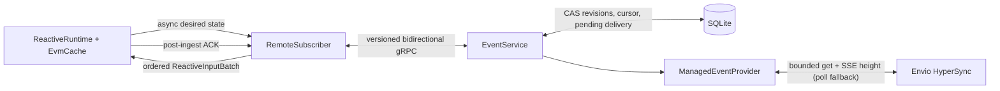

# evm-fork-cache HyperSync subscriber

[](https://github.com/KaiCode2/evm-fork-cache-hypersync/actions/workflows/ci.yml)
[](https://crates.io/crates/evm-fork-cache-hypersync)
[](https://docs.rs/evm-fork-cache-hypersync)
[](#license)

A production-oriented extension workspace that connects `evm-fork-cache`'s
reactive runtime to Envio HyperSync through a durable, remotely deployable event
service. The runtime and indexer service can run on different machines; only the
compact, versioned gRPC protocol crosses the boundary.

## Install

Runtime clients normally use the core and remote crates:

```toml
[dependencies]
evm-fork-cache = { version = "=0.4.0-alpha.4", default-features = false, features = ["reactive"] }
evm-fork-cache-remote = "=0.1.0-alpha.1"
```

Indexer services use `evm-fork-cache-hypersync = "=0.1.0-alpha.1"`. The lower-level
`evm-fork-cache-event-protocol` and `evm-fork-cache-event-service` crates are
available for implementing other source adapters without depending on
HyperSync.

## Workspace

- `evm-fork-cache-event-protocol`: protobuf messages and the bidirectional tonic
  service. Interests are provider-portable; runtime-local matchers and route keys
  never leave the runtime process.
- `evm-fork-cache-event-service`: provider-neutral desired-state preparation,
  durable SQLite sessions/outbox replay, source capabilities, and the tonic
  service. It has no HyperSync dependency.
- `evm-fork-cache-remote`: a tonic `RemoteSubscriber` plus a generic
  `HybridSubscriber` that coordinates any durable historical subscriber with a
  low-latency live subscriber. Desired-state changes commit locally only after
  the service acknowledges its compare-and-swap revision.
- `evm-fork-cache-hypersync`: only the HyperSync source adapter: query
  compilation, deterministic normalization, opaque rollback checkpoints,
  explicit fork recovery, and a runnable composition binary.



## Correctness contract

1. The client replaces the complete owner-scoped desired state with
   `expected_revision -> new_revision`. The source must validate and fully
   prepare the candidate before the service atomically commits it together with
   a sequenced activation barrier.
2. The provider compiles the committed portable interests into a bounded
   HyperSync query. Compact block identity is always requested to prove
   canonical progress. At each height, a requested full header sorts first,
   logs sort next by transaction/log position, and one final compact progress
   record certifies the block identity after every log. A full header is emitted
   only when every field is present and its reconstructed consensus RLP hashes
   to the advertised block.
3. Data, reorgs, source-supported finality, and barriers all use the same delivery
   envelope: session, revision, sequence, token, normalized cursor, and opaque
   provider checkpoint. Before any envelope is sent, the service persists it as
   the session's only in-flight outbox item. A disconnect replays it exactly.
4. `ReactiveEngine::next_ingest_checkpointed` atomically replaces a complete
   cache/canonical/token checkpoint after ingestion and before acknowledgement.
   The service then atomically moves the batch cursor into the acknowledged
   position and clears the outbox. ACKs are idempotent; checkpoint and ACK
   failures retry before another batch is polled.
5. HyperSync rollback guards are compared across acknowledged pages. A mismatch
   backtracks through retained canonical history, emits an explicit sequenced
   reorg delivery, waits for its ACK, then emits the replacement data. Recovery
   fails closed when the fork is deeper than retained history. A fresh source
   engine proves the predecessor of its first rollback-guarded page with a
   separate one-block compact query, so the oldest recoverable ancestor is a
   complete provider-supplied `BlockRef`, never a synthetic hash-only block.
   Owner-only pages below the activation boundary advance the provider scan
   checkpoint without declaring a canonical head. If a fork displaces a branch
   delivered wholly in that owner-only phase, the adapter fails closed because
   protocol v1 has no owner-scoped reorg control; it never rewinds unrelated
   global coverage.
   Once a reorg control is acknowledged, SQLite retains its promised replacement
   tip across reconnects, restarts, and checkpoint-neutral lifecycle barriers.
   The next source delivery must explicitly contain that exact replacement
   anchor. If the source has advanced, every later block through the delivery's
   terminal cursor must be a continuous descendant in the same ordered batch;
   a blockful barrier must stop exactly at the anchor. The promise clears only
   when that certified delivery is acknowledged.

Delivery is deliberately **at least once**. Transport receipt is never a commit.
Use the checkpointed engine loop for stateful handlers: its stored delivery token
makes replay safe across a process crash, while the hybrid coordinator retains
ACK-gated input identities so an unacknowledged in-process replay is never
mistaken for an already-applied cross-source duplicate.

The save-before-ACK crash window is explicit: if runtime checkpoint N is durable
while the service still has N pending above acknowledged cursor N-1, reconnect
sends N's token/checkpoint/coverage proof. Only that exact one-step-ahead proof
is accepted. The unchanged pending envelope replays, the engine recognizes its
stored token and skips handler re-execution, then commits the missing ACK.

## Hybrid HyperSync + WebSocket delivery

`HybridSubscriber<H, L>` composes a durable historical source `H` (the remote
HyperSync subscriber) with a live source `L` (normally Alloy WebSocket):

1. It registers WebSocket first and begins buffering as soon as delivery is
   polled.
2. The first live included-data, canonical-progress, or explicit-barrier proof
   fixes a catch-up fence at the preceding block. Safe/finalized updates alone
   never prove event coverage and cannot trigger cutover.
3. HyperSync pages stream until one reaches the fence. The coordinator does not
   cut over merely because that page arrived; its delivery token must be
   acknowledged after the runtime checkpoint commits.
4. Buffered WebSocket batches are drained, suppressing canonical overlap through
   the acknowledged fence and by stable input identity, then WebSocket owns the
   head.
5. A terminal live error moves the coordinator into recovery. HyperSync fills
   from its acknowledged cursor while a recovered live batch establishes a new
   fence, then the same ACK-gated cutover repeats.

```rust,no_run
use evm_fork_cache::reactive::AlloySubscriber;
use evm_fork_cache_remote::{HybridConfig, HybridSubscriber, RemoteSubscriber};

# async fn build<P>(live: AlloySubscriber<P>) -> Result<(), Box<dyn std::error::Error>>
# where P: alloy_provider::Provider<alloy_network::Ethereum> + Send + Sync,
{
let bearer_token = std::env::var("EVM_FORK_CACHE_EVENT_BEARER_TOKEN")?;
let history = RemoteSubscriber::connect_with_bearer_token(
    "https://indexer.internal:50051",
    "runtime-production-a",
    1,
    &bearer_token,
).await?;
let subscriber = HybridSubscriber::new(history, live, HybridConfig::default())?;
// Bind `subscriber` to ReactiveEngine and drive
// `next_ingest_checkpointed` with one DurableCheckpointStore.
# let _ = subscriber;
# Ok(())
# }
```

Log-only WebSocket events do not carry their block's parent hash, while Hybrid
requires exact parent identity before advancing canonical state. Configure the
Alloy live source with `SubscriberConfig::verify_log_block_context = true` and
attach a separate HTTP provider with
`AlloySubscriber::with_log_verification_provider`. The per-block cache keeps
the extra RPC work bounded, and the separate connection prevents a high-volume
pubsub stream from starving its own verification responses.

The live buffer is independently bounded by batches, records, and accounted
dynamic bytes; the recent-identity and retained-canonical windows are bounded as
well. `HybridConfig::max_source_delivery_token_bytes` and
`max_source_checkpoint_bytes` separately bound each opaque child cursor on
ingress and restore (64 KiB and 1 MiB by default). Active lifecycle activation
and restore also prove that the shared 16-MiB V5 checkpoint can encode one
largest canonical-log record from either source after every configured durable
history and cursor field is already full. Both child positions reserve their
configured maximum cursors, and the conservative saturated-state proof fills the
coordinator and both source histories to `canonical_history_capacity` with
fully populated maximum-width block references. From that validated state it
runs the real one-record commit at the terminal numeric boundary for Historical
and Live, independently in forwarded-token and synthetic-token forms. This
covers exact audience fanout, protected witness retention, source progress,
finality/certification, the maximum synthetic counter, the duplicated
forwarded token, and the eight-byte synthetic last token. It also
fieldwise-dominates terminal-height reorg replacement and arbitrarily divergent
retained source suffixes without predicting a future reorg ancestor. Opaque
probe bytes use their worst-case RLP form, including one-byte cursor budgets.
Overflow, conflicting token reuse, or an unverifiable deep reorg fails closed.
Because active admission requires the fully saturated configured durable state
to fit, unusually large history/cursor combinations may reject before child
mutation even when the current checkpoint is sparse. An
acknowledgeable live item is held without repolling until it can be drained,
preventing one-item durable sources from starving historical catch-up;
lifecycle changes wait behind that item. Delivery tokens carry a
versioned, persisted coordinator-epoch source envelope so ACKs cannot be routed
to the wrong source after either an in-process transition or a process restart.
Child token bytes are immutable within a durable child cursor namespace: an
adapter must never recycle token `A` after emitting `B`, even for the same
payload. Hybrid detects pending and last-token conflicts but intentionally does
not retain an unbounded raw-token history to recognize every `A -> B -> A`
violation. A forwarded child token is accepted only with canonical coverage
that can be restored. A `Some(batch)` containing no records, controls, or token
is malformed; idleness is a pending poll or `Ok(None)`.
Removed/reorg lifecycle signals are never cross-batch deduplicated: the same
identity may be removed, re-included, and removed again, and every transition
must remain visible to the runtime.

Every output also carries a Hybrid checkpoint-format V5 state (independent of
gRPC protocol V1) containing the last runtime-visible position for both
children, the synthetic-token counter, lifecycle fingerprints and owner
generations, finality/canonical suffixes, generation-bound historical coverage,
and an audience-aware identity journal with complete payload witnesses. V5 uses
a private canonical RLP schema inside an 18-byte magic/version/length/CRC32
envelope. The RLP payload is limited to 16 MiB; decoding also enforces count,
identifier, node, and 64 MiB accounted-heap budgets. That 64 MiB value is a
conservative codec accounting model, not a process RSS guarantee: allocator
overhead, temporary stack state, shared buffers, and surrounding runtime memory
remain outside it. The unpublished V4 bincode format is rejected and requires
authoritative resynchronization. CRC32 detects accidental corruption only; it
does not authenticate the checkpoint. Treat the durable checkpoint path as
trusted state and protect it from attacker writes.
Replay and lifecycle fingerprints use separate domain-separated canonical
transcripts rather than Rust/Protobuf serialization. The source-delivery
transcript commits exact input source, confirmations, context positions,
audience, scope, controls, child checkpoint, and child payload commitment.
Restore also proves the outer token epoch/source, coverage head, canonical
ordering, configured window bounds, and overlap with the runtime's retained
history before either child can expose data.

Hybrid uses the runtime's strict chain-control phases: a `Reorg` prefix is
applied before replacement records, then canonical progress, blockful barriers,
safe, and finalized controls are applied after records. Its checkpoint follows
the same order, so sparse event records followed by a certified zero-log tail
retain the final progress head. A reorg placed after a post-record control is
rejected before delivery. Hybrid consumes the core validator's structured
diagnostic: only an `IncompleteRollback` whose required ancestor has aged out
enters historical recovery; intrinsically contradictory input is `Invalid` and
poisons the coordinator. Error-message text is never used as control flow.
Historical coverage certification is monotonic within one lifecycle/branch:
later lower pages cannot reduce a previously acknowledged proof, while
same-height metadata is merged only when compatible. Reorg/reset mutations
still invalidate a proof that crossed the displaced branch.

Retained canonical history may be sparse. Known heights and immediate parent
links are verified exactly, but a gap is not a locally reconstructed ancestry
proof. Within such gaps, the durable historical source's sequenced canonical or
explicit-reorg assertion is the authority. Deploy Hybrid only with a source
whose checkpoint/reorg contract is trusted, and size the retained history and
runtime rollback journal for the maximum fork the source may report.

`DurableReplay` on the Hybrid is a gap-free *position* guarantee backed by `H`;
it is not a promise to reproduce the byte-identical envelope that an ephemeral
`L` emitted before a crash. Full blocks and hydrated pending transactions are
therefore not advertised or accepted: the generic coordinator cannot yet prove
complete body equivalence for those representations. Logs, pending hashes,
owner routing, dynamic interests, explicit reorgs, and finality are advertised
only when both children provide them. Historical backfill and barriers come
from `H`, while live delivery comes from `L`. Hybrid deliberately does not
advertise block-header registration even when both children do because no
provider-neutral contract currently proves that their commitments cover the
same complete wire body.

A manually supplied block-header batch is accepted only as a defensive path:
it must carry the child's `SubscriberPayloadCommitment`, its complete
handler-visible JSON body must fit the hard 256 KiB canonicalization ceiling,
and that body is included in Hybrid's own exact replay witness. Header
hash/context alone cannot prove that two generic provider response bodies are
byte-identical, and Hybrid always emits an outer acknowledgement token even
when a child was originally tokenless. Do not register block-header interests
through Hybrid until a future provider-neutral commitment contract is
negotiated end to end.

When a child supplies a `SubscriberPayloadCommitment`, Hybrid preserves it
unchanged while wrapping the batch in coordinator token/checkpoint metadata. It
also includes that commitment in the persisted child-delivery fingerprint, so a
restored token whose canonical wire payload changed only in commitment fails
closed rather than being acknowledged as the saved delivery.

### Hybrid restart sequence

For a persisted cache, load the durable checkpoint, validate its stored block
hash against an authoritative RPC endpoint, and rebuild a fresh Hybrid plus the
runtime's exact lifecycle topology (base interests or owner interests). On that
same fresh engine:

1. Call `preview_durable_resume_position(&metadata)` to decode and validate the
   runtime checkpoint and obtain the exact position that core restore will pass
   to the subscriber. Do not mutate the engine between preview and restore.
2. For a non-empty base/unowned lifecycle, call
   `prepare_restore_base_lifecycle(&position, base_interests).await`. For every
   owner-managed topology—including installed owners whose filters are all
   empty—call
   `prepare_restore_lifecycle(&position, &[], owners).await`. Preparation
   verifies deterministic portable interest fingerprints, exact-replaces the
   selected topology on an ephemeral live child first, and never mutates the
   durable historical child. A durable live child is left untouched and
   restores its own cursor instead.
3. Prefer `ReactiveEngine::restore_durable_checkpoint` to atomically restore the
   cache, runtime, and subscriber from the loaded checkpoint. If the cache was
   already restored through a separately controlled transaction, pass the same
   metadata to `resume_from_durable_checkpoint`. Either path must derive the
   identical position previewed above. Any partial child restore remains fenced;
   only an exact retry may continue it.
4. Poll normally. Before either source is repolled, the coordinator retries any
   child ACK proven committed by the outer checkpoint. It then enters recovery,
   buffers the already-active live child, and makes `H` witness-validate
   historical overlap before cutover.

Skipping preparation for active base state or any owner topology, supplying
different interests, or restoring a different position fails before polling.
Only the completely empty base/no-owner lifecycle may skip preparation. This
ordering closes the ephemeral-live startup gap without rolling durable
historical desired state backward.

Preparation builds the same checkpoint candidate that restore will install:
it merges and truncates the runtime canonical history, preserves durable
historical and durable-live cursor state, and discards only the cursor namespace
owned by an ephemeral live child. Every active topology must then encode the
complete saturated one-record canonical-log proof described above for both
Historical and Live and for forwarded and synthetic child deliveries before
registration, and the check runs again immediately before either child restore
is staged. This promises one supported record when all three configured
canonical histories and both cursor pairs are already full, including
terminal-height replacement, exact finality/certification, and the widest token
representation. It does not promise capacity for arbitrary multi-record
batches, which still undergo their ordinary exact checkpoint-fit check before
output. An effective-empty owner topology has no possible source delivery, so
it does not reserve source space; a later base or owner activation reruns the
complete proof against the preserved lifecycle state before either child is
mutated.

Hybrid lifecycle topology is intentionally single-mode: use either
base/unowned interests or handler-owned interests, never both. Direct
replacement of one non-empty mode by the other is rejected before either child
is mutated. Clearing either mode to an effective-empty topology is safe and
enters `Live` without polling source traffic. The coordinator first emits one
local, synthetic lifecycle barrier containing the new generation and Hybrid
checkpoint; that exact output replays until ACK, after which polling returns
`Ok(None)`. The barrier preserves each child's restorable checkpoint/canonical
suffix while clearing already-ACKed raw child tokens, and never claims new
source coverage. Installed empty owner identities remain durable topology and
must be supplied on restore. After canonical coverage,
base-to-owner activation is supported only through
`replace_interest_owners_with_global_backfill`; the reverse owner-to-base
transition has no equivalent generic global-backfill primitive and requires a
fresh coordinator restored at an authoritative checkpoint. Normal
`ReactiveEngine` management remains owner-mode throughout.

A child may advance an internal transport/scan cursor while applying lifecycle
state or consuming a state-neutral `Barrier(None)` without emitting an outer
batch. Hybrid intentionally checkpoints only runtime-visible emitted source
positions. Durable children must therefore keep transport and runtime commit
cursors distinct and validate the older runtime position on restore; Hybrid
does not assume every internal cursor movement appears in its checkpoint.

Lifecycle operations are live-first. An error or cancelled future leaves an
explicit reconciliation fence; delivery and ACK are blocked until retry restores
the previous complete lifecycle on *both* children and then reapplies the new
operation. A successful lifecycle mutation is not represented by an older cache
checkpoint: if the durable service committed a newer desired-state revision but
the runtime crashed before another Hybrid checkpoint, restoring the older
checkpoint fails closed on the historical revision proof.

After acknowledged coverage, ordinary compensation cannot prove that no event
crossed a live mutation window that changed or removed a previously active
filter. Even when both children successfully restore the previous filters,
Hybrid therefore enters `Poisoned` and requires reconstruction from an
authoritative checkpoint. Adding a brand-new owner or activating a previously
empty owner remains retryable because no prior active filter was interrupted.
Only the explicit topology-wide global-backfill operation has a generic
certification contract: its compensation enters `Recovering`, discards the
uncertain live queue, and returns to `Live` only after history certifies the
gap.

Mid-lifecycle owner registration is anchored to the runtime's exact canonical
block `C`. The historical revision may route only the retained `C` record as
`OwnerCatchup`; records from `C + 1` through the activation head are routed as
global `CanonicalProgress` for the complete desired-state union. This makes the
new handler's anchor effect part of the already-existing block-`C` rollback
journal and makes every later effect follow the ordinary global journal. Hybrid
rejects an owner-only record before delivery and source ACK unless its exact
block number/hash is still a retained canonical overlap. The core performs
the final, stricter check that the corresponding journal entry still exists.
Owner-only replay can never advance canonical state or substitute for deep
runtime recovery.

`ReactiveEngine::register_handler` reaches this path directly at a non-empty
head. Hybrid first installs the owner's live subscription, then sends the exact
retained `C` boundary only to the historical child; it never asks the live child
to perform historical activation work. An uncertain child result is reconciled
to the previous owner topology before delivery or ACK resumes.

Fresh runtime bootstrap uses exact owner replacement without history. A new or
lost subscriber service attached to a restored runtime instead uses
`ReactiveEngine::sync_handler_interests_with_backfill`, which exact-replaces the
complete topology and requests one global post-`C` backfill. Hybrid forwards
both operations live-first as one revision per child, removes stale owners and
base interests, and reconciles the complete prior topology on cancellation or
error. Do not rebuild a whole runtime with per-owner catch-up calls.

Checkpoint encoding and verification cost scale with `recent_input_capacity`
and `max_recent_owner_entries`. The former is a ceiling on retained input
witnesses, not blocks; the latter bounds the total `(handler, generation)`
associations carried by those witnesses. Hybrid evicts the oldest complete
witnesses deterministically until both configured budgets and the hard V5
decode/16-MiB payload limits fit, while protecting every identity in the
current delivery. Dense owner fanout can therefore shorten the effective
identity window, and a current delivery whose protected suffix cannot fit is
rejected before runtime output. If a replayed overlap identity has aged out,
Hybrid requires full resynchronization rather than suppressing it by block
number alone. `canonical_history_capacity` must cover the deepest supported
Hybrid/source reorg. Measure checkpoint size and durable-store latency with
representative owner ids, fanout, and filters before raising these windows.

Set the consuming runtime's `ReactiveConfig::journal_depth` at least as large
as the service's `EVM_FORK_CACHE_REORG_DEPTH`. Both shipped defaults are 64.
For a longer rollback horizon, raise both settings together; configuring only
the service can let it emit a valid explicit reorg whose ancestor has already
aged out of the runtime journal, in which case ingestion correctly fails
closed.

HyperSync data records carry exact owner ids and an independent delivery scope,
so overlapping owner backfills remain scoped and cannot move global canonical
state. Empty/duplicate/unknown owner audiences, owner-catch-up records without
an exact non-empty owner audience, invalid reorg ancestry, and empty barrier ids
are rejected before buffering. Before payload witnesses or transcripts are
built, Hybrid bounds control count from the byte ceiling and bounds projected
routing work across the whole batch. `All` is charged by installed owner count,
`Owners` by explicit ids, and `AllExcept` by installed owners plus explicit
exclusions, using checked arithmetic even if local filters would later discard
the record. Safe/finalized controls do not prove event coverage; neither does a
blockless barrier. Any forwarded token requires restorable canonical coverage;
therefore a tokened blockless historical barrier is rejected, and a tokened
blockless live delivery during catch-up is unsupported because it cannot both
remain ACK-gated and establish a cutover fence. Adapters should co-sequence that
state with canonical coverage or consume transport-only state internally. Whole-cache
startup/recovery catch-up remains HyperSync's primary role.

## Run the service

```bash
export ENVIO_API_TOKEN=...
export EVM_FORK_CACHE_EVENT_LISTEN=127.0.0.1:50051
export EVM_FORK_CACHE_EVENT_DB=/var/lib/evm-fork-cache/events.sqlite
cargo run -p evm-fork-cache-hypersync --bin evm-fork-cache-hypersync
```

Optional settings:

| Variable | Default | Meaning |
| --- | ---: | --- |
| `EVM_FORK_CACHE_REORG_DEPTH` | `64` | Canonical blocks retained per active session; raise the core runtime journal to at least the same value |
| `EVM_FORK_CACHE_POLL_INTERVAL_MS` | `1000` | REST fallback cadence when SSE has no new height |
| `EVM_FORK_CACHE_SOURCE_REQUEST_TIMEOUT_MS` | `45000` | End-to-end deadline for each source height lookup or adaptive page attempt |
| `EVM_FORK_CACHE_SOURCE_MAX_RESPONSE_BLOCKS` | `2000` | Hard local block-row ceiling per decoded response; independent of the provider's soft query target |
| `EVM_FORK_CACHE_SOURCE_MAX_RESPONSE_LOGS` | `10000` | Hard local log-row ceiling per decoded response; independent of the provider's soft query target |
| `EVM_FORK_CACHE_SOURCE_MAX_RESPONSE_DYNAMIC_BYTES` | `16777216` | Hard local ceiling for decoded row storage and dynamically owned field bytes before validation, sorting, cloning, or normalization |
| `EVM_FORK_CACHE_SOURCE_MAX_RESIDENT_SESSIONS` | `4096` | Maximum session/chain source engines retained in memory |
| `EVM_FORK_CACHE_EVENT_MAX_PERSISTED_SESSIONS` | `65536` | Maximum durable session identities retained in SQLite; prune retired identities offline before raising it |
| `EVM_FORK_CACHE_EVENT_MAX_DELIVERY_BYTES` | `33554432` | Shared service/client delivery ceiling; source pages reserve 64 KiB for framing |
| `EVM_FORK_CACHE_EVENT_BEARER_TOKEN` | unset | Require the same bearer token on remote sessions |
| `EVM_FORK_CACHE_EVENT_TLS_CERT` | unset | PEM certificate path; must be paired with the key |
| `EVM_FORK_CACHE_EVENT_TLS_KEY` | unset | PEM private-key path; must be paired with the certificate |
| `EVM_FORK_CACHE_EVENT_TRUSTED_MESH` | `false` | Explicitly allow a non-loopback listener whose missing encryption and/or client authentication is supplied by a trusted service mesh |
| `RUST_LOG` | `info` | tracing filter |

The server accepts chain IDs in each session and creates the corresponding
HyperSync client dynamically. `hypersync-client` uses Tokio blocking sections
while decoding responses, so embedded servers must use a multi-thread Tokio
runtime; the included binary already does. It enables HTTP/2 keepalive, can
terminate TLS directly, and can require bearer authorization. A proxy or service
mesh remains appropriate for certificate rotation and identity-aware policy.
The binary refuses a non-loopback listener unless direct TLS and bearer
authentication are both configured, or
`EVM_FORK_CACHE_EVENT_TRUSTED_MESH=true` explicitly assigns any missing
encryption and client authentication to that mesh. Server-only TLS encrypts the
connection but does not authenticate clients; a bearer token over plaintext
exposes the credential. Startup logs a prominent warning when the mesh escape
hatch is used.
The service enforces and advertises bounded desired-state limits and allows only
one live connection per durable session. That lease is process-local, so run a
single service process per SQLite database; distributed leasing is explicitly
outside this release.

## Runtime client

```rust,no_run
use evm_fork_cache_remote::RemoteSubscriber;

# async fn connect() -> Result<(), Box<dyn std::error::Error>> {
let bearer_token = std::env::var("EVM_FORK_CACHE_EVENT_BEARER_TOKEN")?;
let subscriber = RemoteSubscriber::connect_with_bearer_token(
    "https://indexer.internal:50051",
    "runtime-production-a",
    1,
    &bearer_token,
).await?;
// Pass `subscriber` to ReactiveEngine, then use the normal async
// register_handler / next_ingest lifecycle.
# let _ = subscriber;
# Ok(())
# }
```

When bearer authorization is enabled, use
`RemoteSubscriber::connect_with_bearer_token` and an `https://` endpoint when
the service terminates TLS. Plaintext bearer transport is appropriate only
inside an authenticated, trusted local service mesh. Authorization values are
retained in memory for reconnect but are never included in protocol messages.

Persisted runtimes should construct with `RemoteSubscriber::connect_from_position`
(or the bearer-authenticated variant), passing the position restored alongside
the cache. The ordinary `connect` constructor is appropriate for fresh state;
the core synchronous restore hook will force proof renegotiation before the next
operation if it is used during a restore flow. If a sequence-zero connection
discovers that the service already has a nonzero runtime-checkpoint cursor,
apply, poll, and acknowledgement stay disabled until that hook proves the
matching runtime checkpoint. A higher transport cursor made only of
checkpoint-neutral activation or scan-progress barriers needs no runtime proof,
because those barriers never mutated the cache. Reusing a session id cannot
silently skip runtime effects in a fresh cache.

On reconnect, the handshake returns both the committed revision and the complete
authoritative desired state, plus service/source capabilities and topology. The
client can therefore resume a CAS update without treating revision zero as
authoritative.

## Supported surface

- Log interests: supported, including address and up to four topic positions.
- Canonical progress: HyperSync compact block envelopes become progress
  controls. Block-header interests are advertised only when the configured
  chain source can supply complete, hash-verified consensus-header RLP.
  The default HyperSync factory and included binary do not advertise headers:
  client 1.4 omits `requests_hash`, which is required for post-Prague Ethereum
  blocks. Compact progress exact-hash-pins lazy reads and installs `NUMBER` plus
  the provider-proven timestamp at the committed canonical head. It never runs
  block-header handlers or fabricates an Alloy header response, and it cannot
  supply `BASEFEE`, `COINBASE`, `PREVRANDAO`, or `GASLIMIT`; those header-only
  fields are cleared. A caught-up event cursor therefore proves event-state
  coverage, not full-header readiness. Consumers that require a complete EVM
  environment must refresh a verified full header or live source before
  simulation.
- Owner-scoped bounded/open backfill: supported at desired-state activation.
  The durable cursor keeps provider scan position separate from runtime-global
  canonical coverage, so a new owner may scan old blocks without rewinding
  unrelated handlers. Activation and scan-only progress use blockless,
  deterministic barriers; records with no audience are discarded rather than
  emitted as empty data.
- Full block bodies and pending transactions: rejected explicitly.
- Reconnect/replay: supported through SQLite desired state, cursor, and outbox.
  Owner backfill intent remains authoritative across reconnect and restart, and
  further lifecycle mutations stay fenced until an acknowledged cursor proves
  the scan reached its activation boundary. Repeating the exact last committed
  acknowledgement is idempotent; stale or different tokens fail closed.
- Reorg and cutover controls: supported as ordinary sequenced, checkpointed,
  acknowledgeable deliveries. The protocol can carry safe/finalized heads, but
  the HyperSync historical adapter does not claim that capability; compose a
  source that actually observes those heads when finality updates are required.
- Source composition: the service boundary uses only protocol-owned desired
  state, delivery, capability, and checkpoint types; provider-native queries and
  rollback guards remain inside the HyperSync adapter.
- Source wakeup: HyperSync SSE height updates are fallible wakeup hints, not
  canonical query bounds. Every delivery attempt reconciles the target through
  REST, so high or downward-corrected SSE values cannot skip or invent archive
  coverage; periodic polling remains the liveness fallback. Fetching is gated by
  explicit client delivery demand so idle sessions do not fill the durable outbox.
  After an acknowledged reorg, both polling paths carry the same durable
  replacement anchor. The managed adapter caps the first refetch at that
  anchor's successor even when REST reports a much newer archive head, allowing
  a quiet replacement range to emit an exact certifying barrier before catch-up.
- Authentication/TLS hooks, bounded quotas, process-local single-consumer
  session leases, SQLite schema migration, and lock-free service counters:
  supported. Multi-process/distributed leasing and a bundled metrics HTTP
  exporter are not included.

## Validation

```bash
cargo fmt --all -- --check
git diff --check
bash scripts/check-worktree-whitespace.sh
cargo test --workspace --all-targets --all-features --locked
cargo test --workspace --doc --locked
cargo clippy --workspace --all-targets --all-features --locked --no-deps -- -D warnings -D clippy::missing_errors_doc
RUSTDOCFLAGS="-D warnings" cargo doc --workspace --no-deps --locked
cargo +1.90.0 check --workspace --all-targets --locked
cargo bench --workspace --no-run --locked
bash scripts/check-security-exceptions.sh
cargo deny check --warn unmaintained
cargo audit --ignore RUSTSEC-2025-0055 --ignore RUSTSEC-2025-0143 --ignore RUSTSEC-2026-0253
bash scripts/test-publication-security-gates.sh
bash scripts/check-secrets.sh
cargo package --locked -p evm-fork-cache-event-protocol
cargo package --list -p evm-fork-cache-remote
cargo package --list -p evm-fork-cache-event-service
cargo package --list -p evm-fork-cache-hypersync
```

Downstream package verification remains intentionally staged until each
upstream extension package exists in the registry. See
[the release procedure](docs/releasing.md) for the exact pinned cargo-deny,
cargo-audit, and Gitleaks versions, the local exact-value credential gate,
publication order, and package-content checks.

Ignored live source and full service/runtime acceptance tests are available when
credentials are present. `HYPERSYNC_TEST_CHAIN_ID` is optional and deliberately
defaults to Ethereum mainnet (`1`); if it is set, the HyperSync and RPC/WebSocket
endpoints must serve that same chain. Cargo does not load `.env` files itself;
export the file into the current shell (with shell tracing disabled) before
running these commands:

The service and Hybrid acceptance cases require an actively producing chain:
the selected backfill window must contain logs, and the WebSocket endpoint must
continue producing new blocks with logs after cutover. A quiet development
chain or inactive filter is expected to time out rather than report a false
pass. `HYBRID_LIVE_BACKFILL_BLOCKS` controls the Hybrid cold-baseline distance
and defaults to `12`; it must fit below the shared RPC/HyperSync archive tip.
HyperSync height is treated as an exclusive upper bound.

```bash
cargo test -p evm-fork-cache-hypersync --test live_hypersync -- --ignored --test-threads=1
cargo test -p evm-fork-cache-hypersync --test live_service -- --ignored --test-threads=1
cargo test -p evm-fork-cache-hypersync --test live_hybrid live_hybrid_restart_reconciles_durable_child_before_repoll -- --ignored --exact --nocapture --test-threads=1
cargo test -p evm-fork-cache-hypersync --test live_comparison -- --ignored --nocapture --test-threads=1
```

See [the performance report](docs/benchmarks.md) for the local normalization
baseline, paired HyperSync/WebSocket measurements, reproducible commands, and
the limits of each measurement.
See [operations](docs/operations.md) for deployment invariants, durability,
security, metrics, and failure recovery.
See [the release procedure](docs/releasing.md) for the compatibility contract,
package order, and reproducible publication gates.
See [the security policy](SECURITY.md) for vulnerability reporting and the
documented advisory exceptions in the initial dependency set.

## License

Licensed under either the [Apache License, Version 2.0](LICENSE-APACHE) or the
[MIT License](LICENSE-MIT), at your option.
